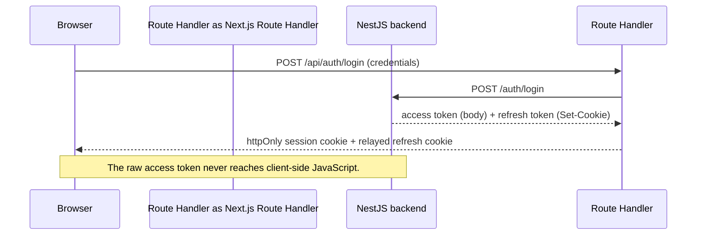

# SecOps frontend

The client for SecOps, a multi-tenant security operations platform covering SIEM, SOAR,
CTI, EDR, DFIR, and vulnerability management. Built with Next.js as the frontend half of a
software engineering internship project, talking to the [SecOps backend](../backend) over a
server-side proxy layer rather than calling it directly from the browser.

## Contents

- [Architecture](#architecture)
- [Tech stack](#tech-stack)
- [Getting started](#getting-started)
- [Environment variables](#environment-variables)
- [Directory structure](#directory-structure)
- [Testing](#testing)
- [Docker and CI/CD](#docker-and-cicd)
- [Known limitations](#known-limitations)
- [Further reading](#further-reading)

## Architecture

### Backend-for-frontend authentication

The browser never sees a raw JWT. Logging in calls a Next.js Route Handler, which forwards
the request to the real backend and, on success, stores the returned access token in an
httpOnly cookie of its own. Every later request that needs it goes through another Route
Handler that reads that cookie server-side and attaches it as an `Authorization` header:



The frontend does not hold the JWT signing secret and does not verify signatures. It only
checks the token's expiry. Sharing a signing secret between two independently deployable
services, just to re-verify a token issued moments earlier over a trusted server call, buys
nothing: the backend's own guards are the real boundary, and they check the signature on
every request regardless of anything the frontend does first.

When an access token expires, a Route Handler's request gets a 401, retries once through a
refresh call using the browser's own refresh cookie, and only then gives up. Server
Components use a non-refreshing variant of the same fetch helper instead, since Next does
not allow setting a cookie during Server Component rendering, and attempting a refresh there
without being able to persist its result would burn the browser's one refresh token for
nothing.

### Two independent layers of route protection

A `proxy.ts` file (Next's renamed middleware) runs on every request and makes an optimistic
check: decode the session cookie, redirect a logged-out visitor to `/login`, redirect an
account still mid-mandatory-password-change to `/change-password`. This check is cheap but
not authoritative. Every protected page also calls `requireSession()` directly, which is the
real per-page boundary, since a shared layout does not necessarily re-run on every sibling
navigation the way a fresh page load does. Underneath both of those, the backend's own
guards are the actual authorization boundary. Neither frontend layer replaces server-side
enforcement; they exist to avoid flashing protected content and to give a faster redirect,
on top of a backend that enforces the same rules regardless.

### One proxy factory instead of forty hand-written routes

Each of the roughly forty routes the six security modules need on the frontend follows the
same shape: validate the request body against a Zod schema, check the caller's role, forward
to the matching backend route, normalize the error response. Rather than write that logic
forty times, a single `proxyToBackend()` factory takes a path, a method, an optional schema,
and an optional role guard, and every module's Route Handler is a thin call into it. The
handful of routes with a genuinely different shape (login, the one streaming route) are
written by hand, but even they share the smaller `parseJsonBody()`/`backendErrorResponse()`
helpers `proxyToBackend()` is itself built from.

### Real-time updates

A Server-Sent Events connection, opened from a small client component on the dashboard and
the asset feed page, receives every module's create, assign, status-change, and unassign
events as they happen. The backend's stream carries no event-type field to distinguish these
cases, so a classifier on the frontend infers the kind of event from which fields are present
on each payload. Rather than hand-patch individual table rows from a partial SSE payload with
no guarantee it matches what a re-fetch would return, each classifiable frame triggers a
debounced refresh of the current page's real data. A toast additionally fires on a new
critical-severity event.

That refresh is `router.refresh()`, Next's soft, client-side re-fetch, everywhere except
three specific row-action components (assignment and status-change controls), which use a
full `window.location.reload()` instead. That inconsistency is intentional, not an oversight:
a live investigation against the deployed app found that `router.refresh()` genuinely fetches
fresh, uncached data from the server in every case, but does not always apply it to those
three already-mounted client components, while the identical pattern works correctly for
CTI and SOAR's create and delete flows in the same app. The exact reason inside Next's client
router cache was not fully chased down. The hard reload is a verified, reliable workaround
for those three components, not a fix for a root cause that is still open.

## Tech stack

- Next.js 16 (App Router, Turbopack), React 19, TypeScript 6
- Tailwind CSS v4, configured through `@theme` in `globals.css` rather than a separate config
  file
- shadcn/ui on top of Base UI, not Radix. Component prop shapes sometimes differ from
  Radix-era examples, which matters when copying from older tutorials
- Zod for schema validation, hand-kept in sync with the backend's own DTOs since the two
  repositories share no types package
- Playwright for end-to-end tests, Jest and React Testing Library for everything else

## Getting started

### Requirements

- Node.js 22 or later
- Docker and the Docker Compose plugin, for the quick-start path below
- A running instance of the [backend](../backend), if you are not using Compose

### Quick start with Docker Compose

The compose file lives one directory up, at the repository root, alongside the backend's own
setup instructions. From there:

```bash
cp .env.example .env   # fill in POSTGRES_* and JWT_SECRET
docker compose up -d
```

This starts Postgres, runs migrations, and brings up the backend and frontend in the correct
order, backend only after Postgres reports healthy, frontend only after the backend does.
Once it is up, sign in at `http://localhost:3001`. The backend itself is not reachable from
your host at all in this setup; the frontend is the only way in, by design.

### Manual setup, without Docker

```bash
npm install
cp .env.local.example .env.local   # fill in BACKEND_URL

npm run dev
```

The dev server runs on port 3001, not Next's usual 3000, since the backend defaults to 3000
itself and the two would otherwise collide on one machine.

## Environment variables

| Variable | Required | Default | Purpose |
|---|---|---|---|
| `BACKEND_URL` | yes | none | The backend API's base URL, including its `/api` prefix. Server-only, never prefixed `NEXT_PUBLIC_` |
| `HTTPS_ENABLED` | no | `false` | Set to `true` only when a real TLS-terminating proxy sits in front of this app. Governs the session cookie's `Secure` flag and the CSP's `upgrade-insecure-requests` directive |

## Directory structure

```
src/
  app/
    login/                 the split-panel login screen, outside the (auth) route group
                            so it is not forced into that group's centered card layout
    (auth)/                forgot-password, change-password
    (dashboard)/           every authenticated page: dashboard, users, tenants, and one
                            folder per security module, all session-gated
    api/                   Route Handlers, the server-side proxy layer described above
  components/
    ui/                    shadcn-generated primitives
    security/              shared row-action components every module page reuses:
                            assignment control, status transition menu, live event handling
    {vm,edr,siem,cti,soar,dfir}/   module-specific components where the shared ones do
                            not fit, for example VM's full-enum status menu
  lib/
    session.ts             cookie read/write, requireSession()
    backend.ts             the fetch wrapper to the NestJS API, including refresh logic
    proxy-route.ts          proxyToBackend(), the shared Route Handler factory
    validations/            Zod schemas mirroring the backend's DTOs, one file per module
  types/                    hand-mirrored types matching backend/prisma/schema.prisma
  proxy.ts                  the optimistic route-protection layer described above
e2e/                        Playwright specs, run against a real running stack
__tests__/                  Jest and React Testing Library specs, root-level on purpose so
                            Jest's default test matching does not treat it as a route
```

## Testing

```bash
npm test              # Jest and React Testing Library, mocked backend
npm run test:e2e      # Playwright, against a real running frontend, backend, and database
```

The Jest suite currently stands at 289 tests. The Playwright suite has 17, covering login,
logout, forgot-password, role-based access for each of the four roles, full tenant and user
CRUD, and one real mutation against each of the six security modules, run against the actual
deployed stack rather than mocks.

## Docker and CI/CD

`Dockerfile` is a multi-stage build using Next's standalone output mode, so the runner image
carries only the compiled app, its pruned dependencies, and static assets, not the full
`node_modules` tree a normal `next build` produces.

Two GitHub Actions workflows sit alongside the existing test suite:

- `build.yml` runs a SonarCloud scan on every push and pull request, then, only on a push to
  `main`, builds and pushes the frontend image to GitHub Container Registry.
- `deploy.yml` triggers once `build.yml` succeeds on `main`, and redeploys the frontend
  service over SSH.

## Known limitations

- The Jest and Playwright suites do not run automatically in CI yet. `build.yml` runs lint
  and the Jest suite as part of its SonarCloud scan step; type-checking and formatting are
  not separate CI steps, and the Playwright suite needs a full running stack a single job
  does not have, so it stays a local and pre-deploy check.
- No pre-commit hooks. The same checks that run in CI can all be run manually, but nothing
  blocks a commit locally today.
- The dashboard hard-codes dark mode. The design this app follows has no light-mode layout,
  so there is no theme toggle to wire up yet.
- The `router.refresh()` staleness issue described above is worked around, not root-caused.
  If it resurfaces in a component not already covered by the hard-reload workaround, treat it
  as the same known issue rather than a new one.

## Further reading

`CLAUDE.md` in this repository has the full, itemized architecture and decision log this
README summarizes, including the exact phase-by-phase history of wiring each module up to
the real backend. `docs/internship-report-frontend.md` is the complete chronological
development log, with the reasoning behind every non-obvious decision and every bug found
along the way.
