# SecOps frontend

The client for SecOps, a multi-tenant platform that gives each client organization one place
to reach its security tooling (SIEM, SOAR, CTI, EDR, DFIR, and vulnerability management).
Built with Next.js as the frontend half of an internship project, talking to the
[SecOps backend](../backend) through a server-side proxy layer rather than calling it
directly from the browser.

The app no longer shows the modules' own data. Each module is an external product on a
private address, and this app launches users into it, manages who may do so, and carries the
ticketing and notification channel between analysts and the people who run the platform.

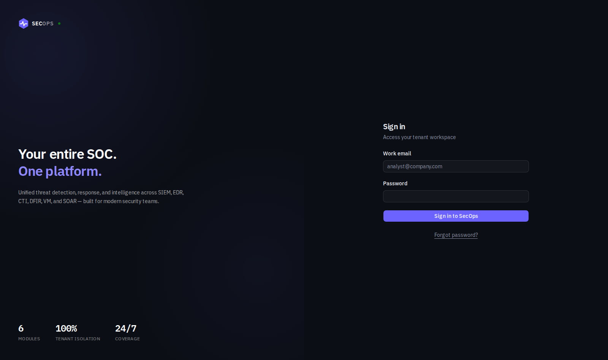

## Contents

- [What the app does](#what-the-app-does)
- [Architecture](#architecture)
- [Tech stack](#tech-stack)
- [Getting started](#getting-started)
- [Environment variables](#environment-variables)
- [Directory structure](#directory-structure)
- [Testing](#testing)
- [Docker and CI/CD](#docker-and-cicd)
- [Known limitations](#known-limitations)
- [Further reading](#further-reading)

## What the app does

There are four roles, and each sees a different app.

**Super Admin** provisions the platform. It creates tenants with their first Admin, decides
which modules each tenant has, and creates Integration Admins.

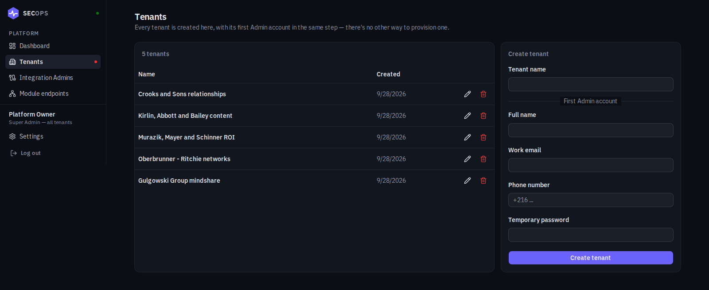

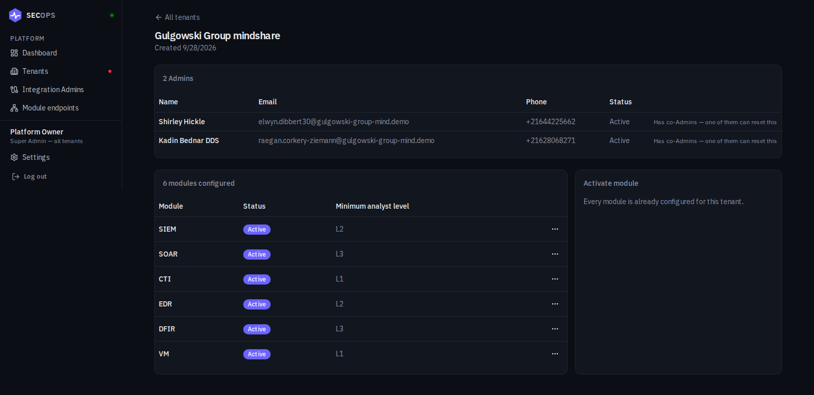

**Integration Admin** works across the whole platform without belonging to a tenant. It sets
the protocol, host, port, and path of each module and can press "Test connection" to check
that the backend can reach it. It also receives every ticket in the Modules category.

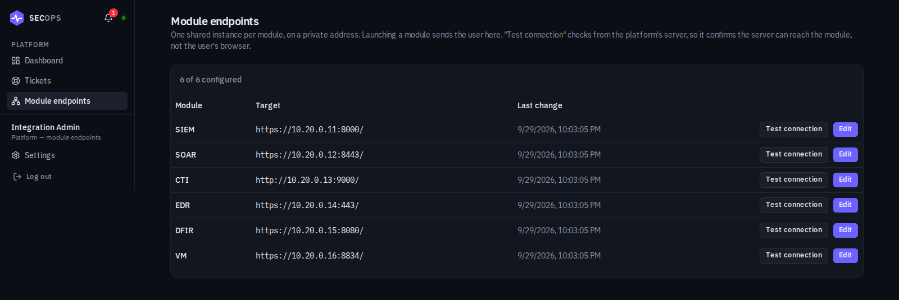

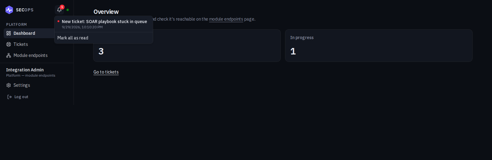

**Admin** runs one tenant. It creates users and gives each Analyst a level, chooses the lowest
level allowed to open each module, opens modules itself, and handles every ticket its tenant
raises.

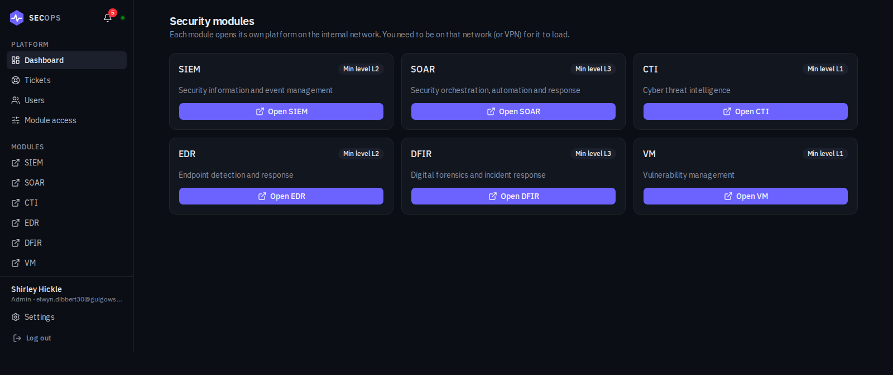

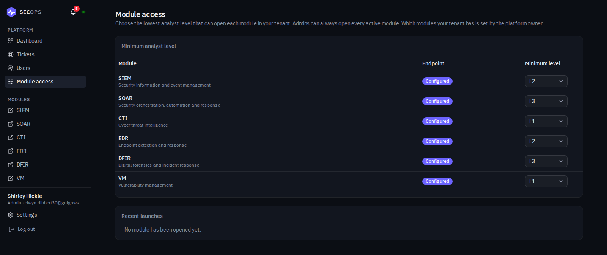

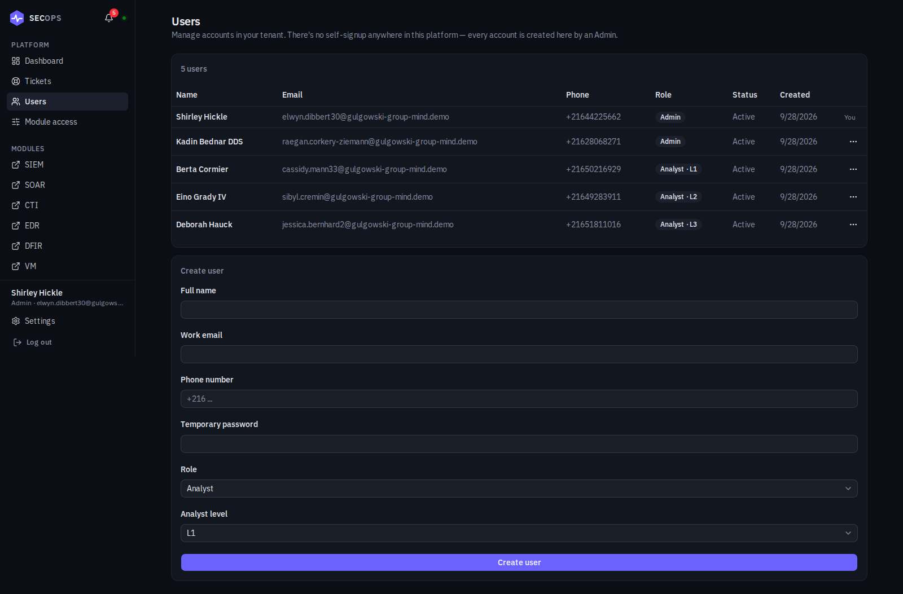

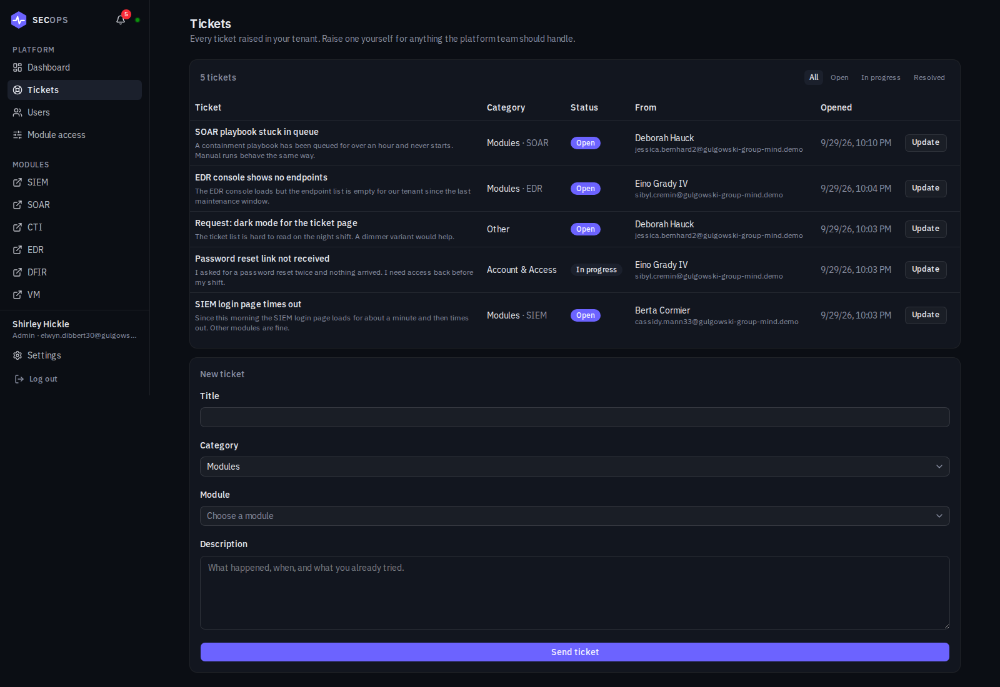

**Analyst (L1, L2, L3)** sees only the modules its level allows. Higher modules are hidden,
not greyed out. An Analyst can raise tickets and follow its own.

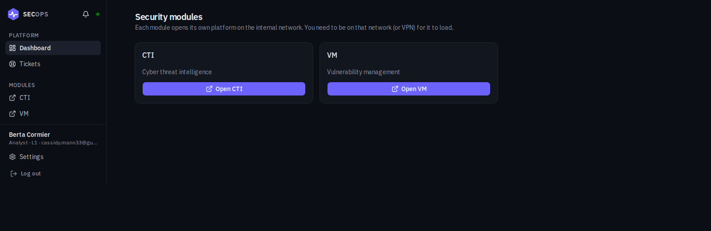

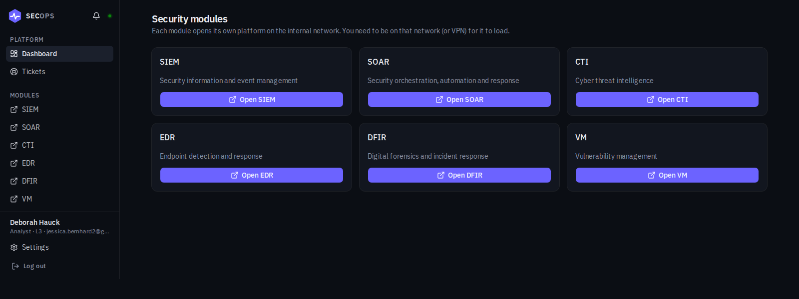

Opening a module sends the browser to the address the Integration Admin configured. The login
is not carried into the module yet, so the module asks for its own credentials. Single
sign-on depends on which product runs behind each module and is the planned next step.

## Architecture

### Backend-for-frontend authentication

The browser never sees a raw JWT. Logging in calls a Next.js Route Handler, which forwards
the request to the real backend and, on success, stores the returned access token in an
httpOnly cookie of its own. Every later request that needs it goes through another Route
Handler that reads that cookie server-side and attaches it as an `Authorization` header:

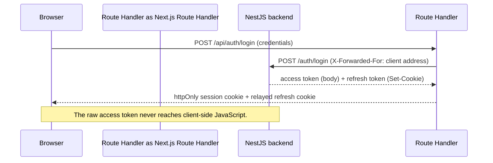

The frontend does not hold the JWT signing secret and does not verify signatures. It only
checks the token's expiry. The backend's own guards are the real boundary, and they check the
signature on every request regardless of anything the frontend does first.

When an access token expires, a Route Handler's request gets a 401, retries once through a
refresh call using the browser's own refresh cookie, and only then gives up. Server
Components use a non-refreshing variant of the same fetch helper instead, since Next does not
allow setting a cookie during Server Component rendering, and refreshing there without being
able to save the result would burn the browser's one refresh token for nothing.

Every request the app makes to the backend comes from this server, so the backend would see
one address for every user. `backendFetch` therefore forwards the last `X-Forwarded-For` hop,
the address Next itself recorded, and the backend uses it to rate limit each client
separately. The backend trusts that header only from loopback and private-network senders.

### Two independent layers of route protection

A `proxy.ts` file (Next's renamed middleware) runs on every request and makes an optimistic
check: it decodes the session cookie, redirects a logged-out visitor to `/login`, and
redirects an account still in its mandatory password change to `/change-password`. This check
is cheap but not authoritative. Every protected page also calls `requireSession()` directly,
which is the real per-page boundary. Underneath both, the backend's guards decide what is
allowed. The frontend layers exist to avoid flashing protected content and to redirect faster.

Route Handlers add a third check of their own through `src/lib/api-guards.ts`
(`requireIntegrationAdmin`, `requireTenantMember`, and so on), so a request is refused before
it reaches the backend when the role is already known to be wrong.

### One proxy factory

Almost every Route Handler follows the same shape: validate the request body against a Zod
schema, check the caller's role, forward to the matching backend route, and normalize the
error. A single `proxyToBackend()` factory takes a path, a method, an optional schema, and an
optional guard, and each route is a thin call into it. Login and the event stream have a
different shape and are written by hand, but they share the helpers `proxyToBackend()` is
built from.

Route parameters reach a Route Handler already URL-decoded, so a value like `..%2F..%2Fusers`
would otherwise turn into a path that climbs to a different backend route. The factory
re-encodes every parameter with `encodeURIComponent` and rejects `.` and `..` outright. For
routes with no dynamic segment Next passes a context whose `params` resolve to `undefined`, and
the factory falls back to an empty object.

### Live notifications

A bell in the sidebar (Admin, Analyst, Integration Admin) loads the stored notifications when
the page opens and then listens on `/api/events/stream`, a Server-Sent Events connection
proxied to the backend. A `notification.created` frame adds an entry, raises a toast, and
refreshes the page's data. Opening a notification marks it read and goes to the tickets page.
"Mark all as read" clears the counter.

The stream is per user, not per tenant, which is how an Integration Admin, who has no tenant,
receives notifications for Modules tickets from every tenant.

## Tech stack

- Next.js 16 (App Router, Turbopack), React 19, TypeScript 6
- Tailwind CSS v4, configured through `@theme` in `globals.css` rather than a separate config
  file
- shadcn/ui on top of Base UI, not Radix. Component prop shapes sometimes differ from
  Radix-era examples, which matters when copying from older tutorials
- Zod for schema validation, kept in sync by hand with the backend's DTOs since the two
  repositories share no types package
- Playwright for end-to-end tests, Jest and React Testing Library for everything else

## Getting started

### Requirements

- Node.js 22 or later
- Docker and the Docker Compose plugin, for the quick-start path
- A running instance of the [backend](../backend), if you are not using Compose

### Quick start with Docker Compose

The compose file lives one directory up, at the repository root. From there:

```bash
cp .env.example .env   # fill in POSTGRES_* and JWT_SECRET
docker compose up -d
```

This starts Postgres, runs migrations, and brings up the backend and the frontend in order:
the backend once Postgres is healthy, the frontend once the backend is. Sign in at
`http://localhost:3001`. The backend is not reachable from your host in this setup, by design.
Seeding the first Super Admin and the demo tenants is described in the backend README.

### Manual setup, without Docker

```bash
npm install
cp .env.local.example .env.local   # fill in BACKEND_URL

npm run dev
```

The dev server runs on port 3001, since the backend uses 3000. To run it on another port, for
example when a virtual machine already forwards 3001, use `npx next dev -p 3002`.

## Environment variables

| Variable | Required | Default | Purpose |
|---|---|---|---|
| `BACKEND_URL` | yes | none | The backend API's base URL, including its `/api` prefix. Server-only, never prefixed `NEXT_PUBLIC_` |
| `HTTPS_ENABLED` | no | `false` | Set to `true` only when a TLS-terminating proxy sits in front of this app. Governs the session cookie's `Secure` flag and the CSP's `upgrade-insecure-requests` directive |

## Directory structure

```
src/
  app/
    login/                 the split-panel sign-in screen
    (auth)/                forgot-password, change-password
    (dashboard)/           every authenticated page, session-gated:
                            dashboard, tenants, integration-admins, module-endpoints,
                            module-access, users, tickets
    api/                   Route Handlers, the server-side proxy layer described above
  components/
    ui/                    shadcn-generated primitives
    auth/  dashboard/  tenants/  users/  integration-admins/
    modules/               module tiles and the launch button
    module-endpoints/      endpoint table, edit dialog, connection test
    tickets/               ticket form, table, status menu
    notifications/         the bell and its live stream handling
  lib/
    session.ts             cookie read/write, requireSession()
    backend.ts             the fetch wrapper to the NestJS API, refresh logic, client address
    proxy-route.ts         proxyToBackend(), the shared Route Handler factory
    api-guards.ts          role checks used by Route Handlers
    roles.ts  modules.ts  tickets.ts  notifications.ts   small helpers shared by pages
    validations/           Zod schemas mirroring the backend's DTOs
  types/                   types mirroring the backend's responses
  proxy.ts                 the optimistic route-protection layer
e2e/                       Playwright specs, run against a real running stack
__tests__/                 Jest and React Testing Library specs
docs/screenshots/          the images used in this README
```

## Testing

```bash
npm test              # Jest and React Testing Library, mocked backend
npm run test:e2e      # Playwright, against a real running frontend, backend, and database
```

The Jest suite has 192 tests in 29 files. The Playwright suite has 16 tests in 6 specs. It
covers the login, logout and forgot-password behavior, role-based access for each of the four roles, tenant and user
management, the module launch redirect with level gating in both directions, and the ticket
flow between two live browsers: an Analyst raises a ticket, the Integration Admin's bell
updates without a reload, a status change notifies the Analyst, and the creator can only
withdraw. See `e2e/README.md` for how to run it.

## Docker and CI/CD

`Dockerfile` is a multi-stage build using Next's standalone output, so the runner image
carries only the compiled app, its pruned dependencies, and static assets.

Two GitHub Actions workflows run this repository's checks and deployment:

- `build.yml` runs lint, the Jest suite with coverage, and a SonarCloud scan on pushes to
  `main` and on pull requests. Only on a push to `main`, and only if that passes, it builds the
  frontend image and pushes it to GitHub Container Registry.
- `deploy.yml` runs once `build.yml` succeeds on `main`. It runs on a self-hosted runner on the
  deployment VM (label `secops-vm`), pulls the new image, and restarts the `frontend` service
  with `docker compose`. It never touches `postgres` or `backend`. The backend must already be
  healthy, because the frontend container waits for it.

The steps for preparing that VM are in [`../VM_SETUP.md`](../VM_SETUP.md), and the secrets the
pipelines need are in [`../CICD_SETUP.md`](../CICD_SETUP.md).

## Known limitations

- A module launch does not carry the user's login. Single sign-on waits on knowing which
  product runs behind each module.
- The Playwright suite needs a full running stack, so it runs locally and before a deploy, not
  in a single CI job. Type-checking and formatting are not separate CI steps either.
- No pre-commit hooks. The checks CI runs can all be run by hand.
- The dashboard hard-codes dark mode. There is no light layout, so there is no theme toggle.
- The tickets and users pages put their form beside the table only from 1700px wide. Below
  that the form sits under the table, so the table keeps enough width for its columns.
- The notification bell keeps the latest 30 notifications. Older ones stay in the database
  and are never pruned.

## Further reading

`CLAUDE.md` in this repository has the itemized decision log this README summarizes, phase by
phase, including the security audit. `docs/internship-report-frontend.md` is the chronological
development log of the first version and is kept as a historical record: it describes module
pages that no longer exist.
